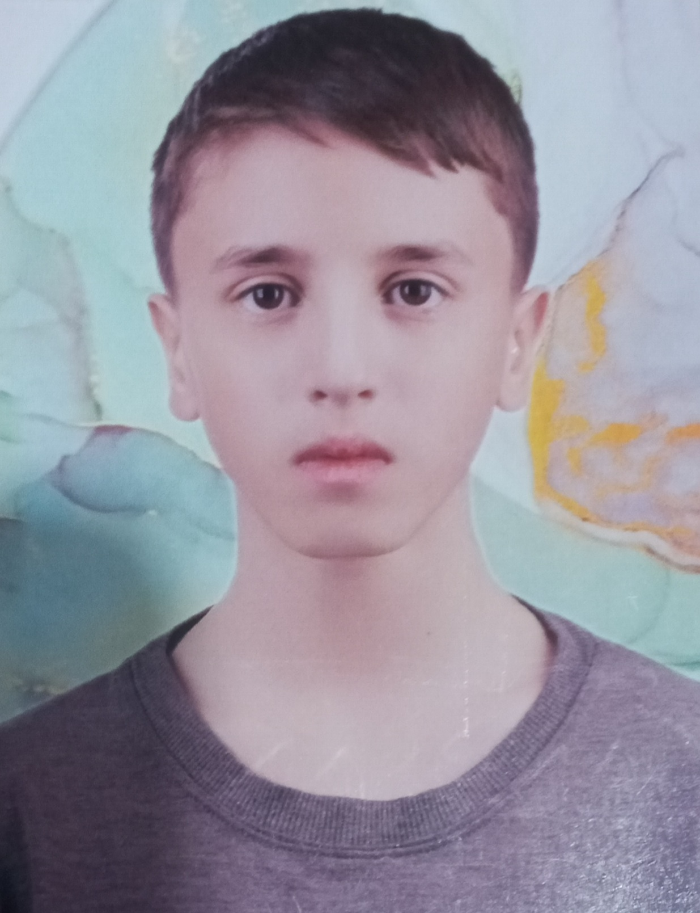

# KidMath - Educational Math Game for Kids

<table>
<tr>
<td width="70%">

## About the Developer
AmirMohammad Mohammadi, my son, is a 7th-grade student. This project was developed for the 11th Khwarizmi Youth Festival, showcasing his passion for programming and educational technology.


03/17/2025
</td>
<td width="30%" align="right">
  
</td>
</tr>
</table>

## Project Description
KidMath is an engaging educational game designed to help elementary school students learn and practice basic arithmetic operations. The game focuses on addition and subtraction of two-digit numbers, making it perfect for first-grade students.

## Screenshots
<table>
<tr>
<td width="50%" align="center">
  
  <p><em>Main Game Interface</em></p>
</td>
<td width="50%" align="center">
  
  <p><em>Gameplay in Action</em></p>
</td>
</tr>
</table>

### Features
- Three difficulty levels for computer opponent (Easy, Normal, Hard)
- Multiple game stages with increasing complexity
- Visual card-based interface for better learning experience
- Score tracking system
- Heart and star-based lives system
- Bilingual interface (Persian)

### Technical Details
- Built with Python and PySide6 (Qt for Python)
- Uses a card-based visual system for numbers and operations
- Modular design allowing easy addition of new levels
- Responsive and user-friendly interface

### Game Rules
1. Players compete against a computer opponent
2. Each correct answer earns points
3. Players have limited lives (hearts) for the entire game
4. Each question has limited attempts (stars)
5. Progress through levels by achieving required scores
6. Game ends when either player reaches the maximum score or loses all lives

## Installation
1. Ensure Python 3.x is installed on your system
2. Install required dependencies:
```bash
pip install PySide6
```
3. Run the game:
```bash
python main.py
```

## Project Structure
```
KidMath/
├── assets/
│   ├── level-1/
│   ├── level-2/
│   ├── level-3/
│   ├── signs/
│   └── logo.png
├── main.py
└── README.md
```

## Contact
- Shad Platform: [AmirMMohammadi1391](https://shad.ir/AmirMMohammadi1391)
- Parent Contact: 09372561238

## License
This project is developed for educational purposes and is free to use. 
